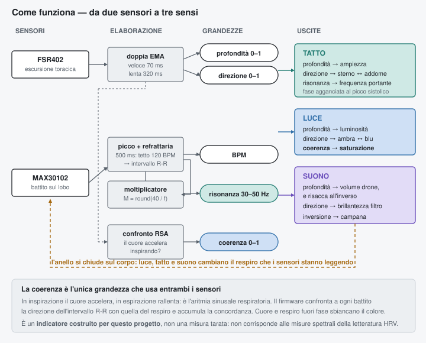

# Neural Resonance Method

**Un apparecchio di biofeedback respiratorio su ESP32.** Legge il respiro e il battito cardiaco, e con quei due segnali pilota tre canali sensoriali sincronizzati: vibrazione, luce e suono.

Nato come progetto di elettronica e trattamento del segnale, documentato per essere ricostruito, misurato e — soprattutto — discusso in aula. Tutti i dimensionamenti sono verificati contro le schede tecniche dei costruttori e riportati per esteso, compresi gli errori commessi durante la progettazione e come sono stati trovati.

> **Non è un dispositivo medico.** Non va usato per diagnosi, monitoraggio clinico o terapia. Leggi [SAFETY.md](SAFETY.md) prima di costruirlo: contiene una controindicazione assoluta per chi porta dispositivi cardiaci impiantati.

---

## Cosa fa, concretamente

Due sensori in ingresso — una fascia toracica con sensore di forza, un sensore ottico di battito sul lobo dell'orecchio — da cui il firmware ricava quattro grandezze. Ciascuna pilota qualcosa di diverso:

| Grandezza | Tatto | Luce | Suono |
|---|---|---|---|
| **Profondità** del respiro (0–1) | ampiezza della vibrazione | luminosità | volume del drone ↑, risacca ↓ |
| **Direzione** insp./esp. (0–1) | ripartizione sterno ↔ addome | colore ambra ↔ blu | brillantezza del filtro |
| **Frequenza cardiaca** (BPM) | portante 30–50 Hz, fase agganciata al battito | — | — |
| **Coerenza cardiorespiratoria** (0–1) | — | saturazione del colore | intensità della campana |
| **Cambio di direzione** (evento) | — | — | campana: acuta al vertice, grave al fondo |



L'ultima riga della colonna "Luce" è la parte interessante. La saturazione del colore non segue il respiro: segue **quanto il cuore sta rispondendo al respiro** — l'aritmia sinusale respiratoria. È l'unico indicatore che usa entrambi i sensori insieme, e l'unico che non si può falsificare con la volontà.

> **Attenzione a quanto pesa quel numero.** L'indice di coerenza è stato costruito appositamente per questo progetto: una media mobile della concordanza fra direzione dell'intervallo R-R e direzione del respiro. È plausibile e si comporta ragionevolmente, ma **non è tarato contro niente** e non corrisponde alle misure spettrali usate nella letteratura sull'HRV. È un indicatore di riscontro, non una misura. Nel resto del repository i numeri sono verificati sulle schede dei costruttori; questo no, ed è giusto saperlo.

## Tre modalità di lavoro

| Modalità | Come si attiva | A cosa serve |
|---|---|---|
| **Sham** | ponticello D4 verso GND all'accensione | Sessione di controllo: la portante a 40 Hz non viene generata, **tutto il resto è identico**. Serve a confrontare sessioni con e senza stimolazione senza sapere quale si sta facendo |
| **Ingressi sintetici** | `#define INGRESSI_SINTETICI 1` | Respiro e battito generati dal firmware, con aritmia sinusale simulata. Sviluppo, debug e dimostrazioni in classe senza sensori né volontari |
| **Telemetria** | `#define TELEMETRIA 1` | CSV a 115200, sempre disponibile. All'avvio stampa il registro delle sessioni |

Il ponticello sham non è un `#define` di proposito: un `#define` lo decide chi compila, che quindi sa sempre in quale condizione si trova, e il confronto non vale niente. Il ponticello lo può mettere un'altra persona, o lo si tira a sorte annotando l'esito su un foglio da aprire alla fine.

Ogni sessione più lunga di due minuti finisce nel **registro in flash**: durata, coerenza media, BPM medio e flag sham, fino a 500 sessioni. Il record si scrive quando si toglie il sensore dal lobo, che è il gesto naturale di fine sessione. Si rileggono compilando con `TELEMETRIA 1`.

---

## Perché può interessare a un insegnante di matematica e fisica

Il progetto è stato scritto con i conti in chiaro. Non è "collega questo qui e funziona": ogni valore è ricavato, e diversi valori sbagliati della prima stesura sono documentati insieme al calcolo che li ha smascherati. Vedi [docs/didattica.md](docs/didattica.md) per i percorsi completi; in sintesi:

**Matematica**
- Approssimazione all'intero più vicino con limite d'errore dimostrabile: il moltiplicatore armonico garantisce un errore < f<sub>cuore</sub>/2, cioè sotto mezzo hertz. Si dimostra in cinque righe.
- Media mobile esponenziale come filtro passa-basso discreto, e l'incrocio di due EMA come stima robusta della derivata.
- Aritmetica modulare: l'accumulatore di fase a 32 bit è un contatore mod 2³², e il traboccamento *è* il comportamento corretto.
- Legge di potenza: la correzione gamma esiste perché la percezione è logaritmica.

**Fisica**
- Filtri RC: frequenza di taglio, attenuazione in dB, resistenza equivalente di Thévenin. Il filtro del progetto attenua la portante di 45 dB e lascia passare il segnale utile intatto — e si misura con un multimetro da 18 €.
- Risonanza: il trasduttore ha Fs = 30 Hz e si usa a 40 Hz, appena sopra la risonanza.
- Dissipazione in un MOSFET: P = I²R, e il confronto fra due componenti quasi identici che a 5 V di pilotaggio si comportano in modo opposto.
- Modulazione di larghezza d'impulso, valore medio, e perché il valore medio deve restare fisso mentre l'ampiezza varia.

**Trasversale**
- Aritmia sinusale respiratoria: il battito accelera in inspirazione e rallenta in espirazione. Il progetto la misura, non la assume.

---

## Come si monta: tre disposizioni

I trasduttori tattili pesano **1,18 kg l'uno** e la loro scheda tecnica dice di installarli su una superficie piana. Non è una questione di comodità: un trasduttore inerziale funziona reagendo contro la propria massa, e ha bisogno di qualcosa di rigido a cui trasferire l'energia. Sul corpo il tessuto molle assorbe quasi tutto.

Ed è una conseguenza della fisica, non del prodotto: per muovere massa a 40 Hz servono massa ed escursione. Un attuatore leggero non può erogare forza apprezzabile a quella frequenza. **Il peso è la prestazione.**

| | Dove va la vibrazione | Cosa serve costruire |
|---|---|---|
| **A · Mobile esistente** | trasduttori avvitati sotto la seduta e dietro lo schienale di una sedia di legno, o su due doghe del letto | niente |
| **B · Pannello** | compensato o MDF 15–18 mm, 40 × 90 cm, trasduttori bullonati sotto, ci si sdraia sopra | un taglio in ferramenta |
| **C · Ibrida** | i 40 Hz restano sotto la schiena; due micromotori sulla fascia toracica portano lo scivolamento sterno ↔ addome | come B, più 23,98 € di componenti |


La **disposizione C** separa due funzioni che hanno bisogni opposti. La portante a 40 Hz vuole forza, quindi massa, quindi un appoggio rigido: va sotto la schiena, dove la massa non costa niente. Lo scivolamento alto/basso col respiro è invece una rampa lenta di intensità, e la esegue benissimo un motorino da pochi grammi. Così si sente la vibrazione muoversi sul torace **senza caricare di massa la gabbia toracica che il dispositivo sta misurando** — che sarebbe un confondimento della misura, non solo un fastidio.

Sul firmware è un solo `#define`:

```cpp
#define DISPOSIZIONE_IBRIDA  0   // 0 = base, 1 = con i motorini sul corpo
```

A 1 i tre canali LED passano su un espansore PCA9685 via I²C, liberando due pin PWM nativi per i motorini: la disposizione ibrida richiede sette canali PWM e l'Uno ne ha sei.

Dettagli, quote e vincoli in [hardware/WIRING.md](hardware/WIRING.md#montaggio-meccanico) — compreso il perché l'imbottitura spessa spegne il dispositivo, dove vanno i LED se si medita da sdraiati, e quali punti del corpo si possono imbottire senza perdere l'accoppiamento.

## Struttura del repository

```
firmware/
  nrm_v3_esp32/         firmware corrente: ESP32, sintesi audio software,
                        40 Hz da DAC, coerenza RSA, sham, ingressi sintetici
  nrm_v2_trasduttori/   versione Arduino Uno, con VS1053 e MIDI (vedi sotto)
  nrm_v1_erm/           prima versione con motori a massa eccentrica
hardware/
  BOM.md                distinta con link, prezzi e quantità
  WIRING.md             collegamenti, dimensionamenti e montaggio meccanico
  VERIFICATION.md       verifica incrociata su schede tecniche + bilancio di potenza
docs/
  didattica.md          i percorsi di matematica e fisica, con i conti
SAFETY.md               leggere prima di costruire
NOTICE.md               avvertenze legali e licenze
```

## Perché ESP32 e non Arduino

Il progetto è nato su Arduino Uno, e metà del lavoro è finito in aggiramenti dei suoi limiti: sette canali PWM richiesti su sei disponibili, MIDI e telemetria che si escludono per via dell'unica porta seriale, i timer da proteggere per non rompere `millis()`, `sqrt()` spostata fuori dal loop, la tabella seno che pesa sui 2 KB di RAM.


Sull'ESP32 **nessuno di quei problemi esiste**, e insieme spariscono tre componenti:

| Sull'Uno serviva | Sull'ESP32 |
|---|---|
| VS1053 comandato via MIDI, timbri General MIDI | il suono è **sintetizzato dal firmware**: tre voci a 22050 Hz su un task dedicato del core 0 |
| PWM a 31 kHz + rete RC + attenuatore + collaudo in continua a tre punti | **due DAC veri**: esce già tensione analogica, resta un partitore per il livello |
| PCA9685 per avere abbastanza canali PWM | **16 canali LEDC** indipendenti, ne restano undici liberi |
| Pulse Sensor analogico 3,3★ con filtro di alimentazione e antialias | **MAX30102** digitale a 3,3 V, la stessa logica dell'ESP32 |

Il prezzo da pagare è uno solo: la logica a 3,3 V non basta a pilotare i gate dei MOSFET, e serve un buffer **SN74HCT245** da 11 €. In cambio la configurazione consigliata scende da 443,94 € a **384,16 €** e sparisce l'unico componente su cui la riuscita non era garantita.

La versione Uno resta nel repository, completa e documentata. Non è deprecata: è solo la strada più lunga.

### Le tre versioni del firmware

La `v2` è la versione Arduino Uno appena descritta. La `v1` pilota due motori a massa eccentrica, come nel progetto iniziale. **Non è deprecata per capriccio: non può funzionare come previsto**, e il perché è istruttivo. Un motore a massa eccentrica produce vibrazione ruotando, e la sua costante di tempo meccanica è 20–50 ms; un periodo da 40 Hz dura 25 ms. Il rotore non fa in tempo né ad accelerare né a fermarsi, e quello che si percepisce è un ronzio a intensità costante.

Resta nel repo perché il confronto fra le due versioni è il pezzo più utile del progetto: stesso codice, stesso obiettivo, e un limite fisico che nessuna quantità di software può aggirare.

---

## Stato del progetto

| | |
|---|---|
| Firmware ESP32 | scritto e commentato, **non ancora compilato né collaudato su hardware** |
| Dimensionamenti | verificati sulle schede dei costruttori (Espressif, Dayton Audio, TI, AOS, Maxim, Interlink) |
| Distinta | inserzioni verificate a settembre 2026 |
| Hardware fisico | non ancora costruito |

Il firmware ha **una sola dipendenza esterna**, la libreria SparkFun MAX3010x, ed è scritto per arduino-esp32 2.0.x. Ma **finché non gira su una scheda vera va trattato come un progetto sulla carta**. Chi lo costruisce per primo è invitato ad aprire una issue con quello che trova.

---

## Riconoscimenti e onestà sulle fonti

Il filone di ricerca sulla stimolazione gamma a 40 Hz nasce dal lavoro del MIT sui modelli murini di Alzheimer e riguarda stimolazione **luminosa e sonora**. Gli studi sull'uomo sono preliminari, e la stimolazione **tattile** a 40 Hz è studiata molto meno delle altre due. Il nome del progetto viene da lì, ma **il progetto non pretende di riprodurre quei risultati né di verificarli**.

Quello che il progetto fa in modo documentabile è biofeedback respiratorio, che ha effetti reali e ben studiati, e che si può misurare con gli strumenti descritti qui dentro.

## Licenza

Firmware: **MIT** (vedi [LICENSE](LICENSE)).
Documentazione, schemi e distinta: **CC BY-SA 4.0**.

Avvertenze legali e controindicazioni: [NOTICE.md](NOTICE.md).

Uso didattico e personale incoraggiato. Se lo porti in classe e funziona — o se non funziona — mi fa piacere saperlo.
