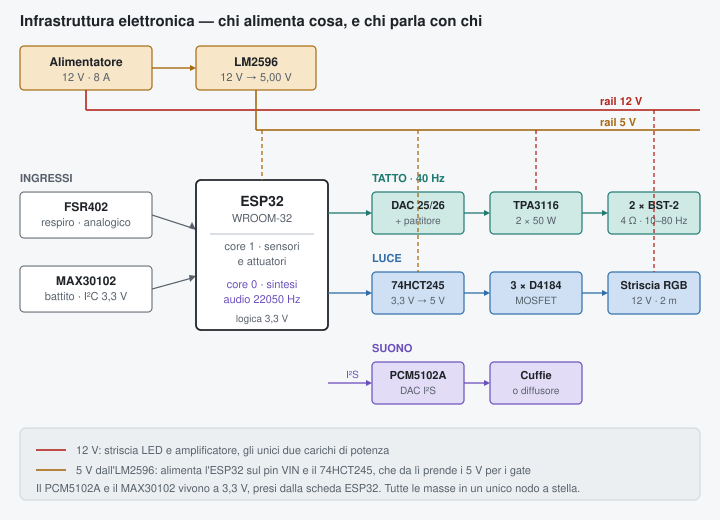
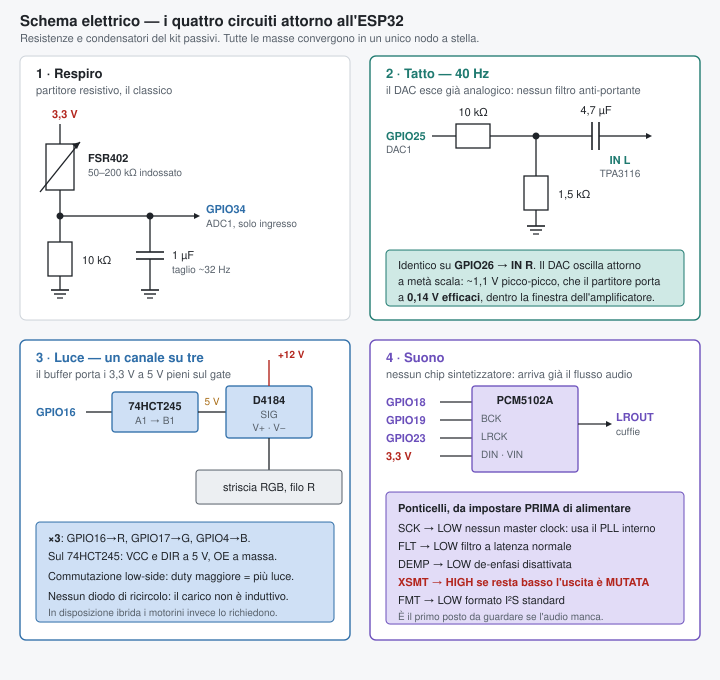
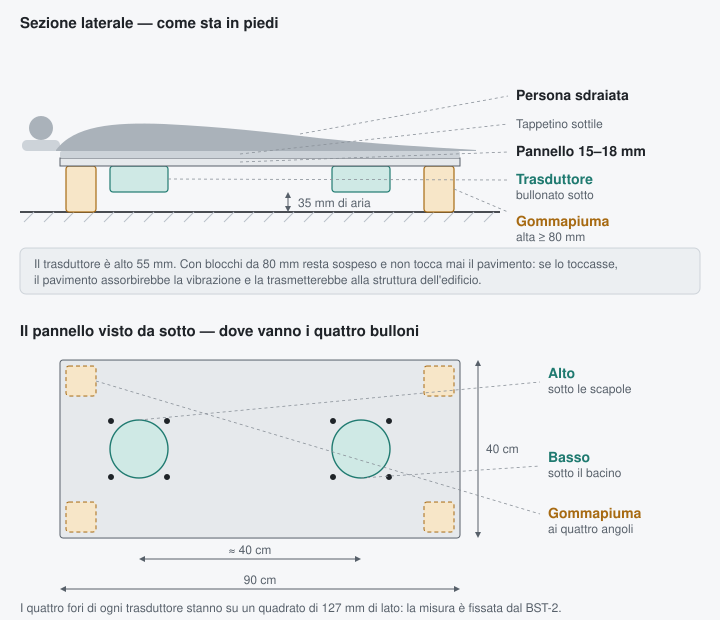
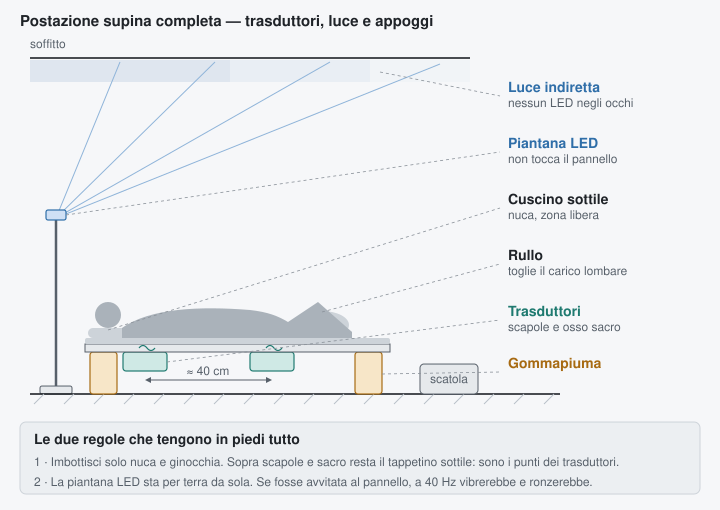
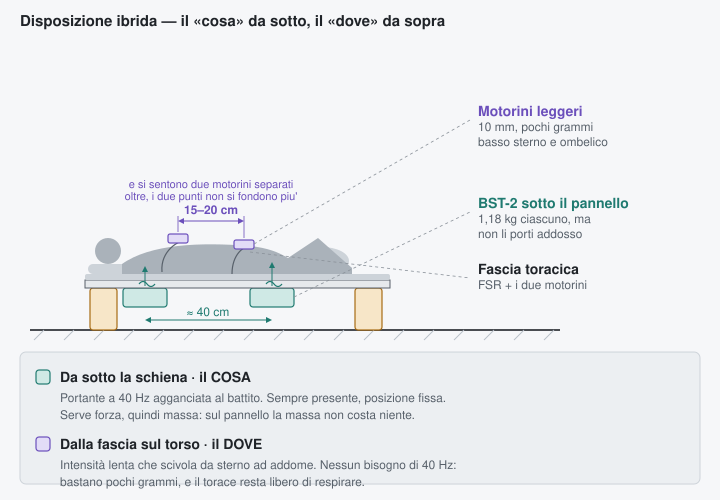

# Collegamenti

## Mappa pin

Il progetto è su **ESP32-WROOM-32**, scheda DevKit a 38 pin. Tre limiti reali del chip hanno deciso quasi tutta la mappa:

1. **ADC2 non funziona quando il Wi-Fi è attivo** → ogni ingresso analogico deve stare su ADC1, cioè GPIO 32–39.
2. **I DAC esistono solo su GPIO 25 e 26** e non sono spostabili altrove.
3. **GPIO 6–11 sono la flash SPI** e non vanno toccati; **34–39 sono solo ingresso** e senza pull-up; **0, 2, 12, 15** sono pin di strapping.



| GPIO | Funzione | Nota |
|---|---|---|
| 34 | FSR402 — respiro | ADC1_CH6, solo ingresso: va bene, è un analogico |
| 21 | I²C SDA → MAX30102 | il sensore è a 3,3 V, **nessun traslatore** |
| 22 | I²C SCL → MAX30102 | |
| 25 | **DAC1** → partitore → ampli L | trasduttore sterno |
| 26 | **DAC2** → partitore → ampli R | trasduttore addome |
| 18 | I²S BCK → PCM5102A | |
| 19 | I²S LRCK → PCM5102A | |
| 23 | I²S DIN → PCM5102A | |
| 16 | LED rosso → 74HCT245 → gate MOSFET | |
| 17 | LED verde → 74HCT245 | |
| 4 | LED blu → 74HCT245 | |
| 27 | motorino sterno (ibrida) → 74HCT245 | |
| 13 | motorino addome (ibrida) → 74HCT245 | |
| 33 | ponticello sham verso GND | pull-up interno |
| 2 | LED di stato | integrato sulla scheda, zero cablaggio |
| liberi | 5, 14, 15, 32, 35, 36, 39 | |



Nessun timer da spartire e nessun prescaler da proteggere: il **LEDC ha 16 canali PWM indipendenti** e il canale tattile ha un timer hardware tutto suo. Tutta la sezione sui timer che serviva sull'Uno è sparita.

---

## Il canale tattile è diventato banale

È la semplificazione più grande del passaggio all'ESP32.

Sull'Uno il 40 Hz nasceva da un PWM a 31 kHz, e serviva una rete RC per cancellare la portante più un attenuatore per non saturare l'amplificatore — con tanto di collaudo in continua a tre punti per verificare che il rapporto fosse giusto.

**L'ESP32 ha due convertitori digitale-analogico veri.** Escono già tensioni analogiche: nessuna portante, nessun filtro anti-alias, nessun collaudo. Un interrupt di timer a 4 kHz scrive cento campioni per ogni ciclo da 40 Hz, contro i pochi gradini che il PWM a 8 bit riusciva a dare.

```
GPIO25 (o 26) ──[10 kΩ]──┬──[1,5 kΩ]── GND        ← solo per il livello
                         └──[4,7 µF]── ingresso amplificatore

TPA3116 uscita L ──── trasduttore STERNO
TPA3116 uscita R ──── trasduttore ADDOME
```

Il DAC dell'ESP32 esce fra 0 e ~3,2 V. L'ampiezza utile è ±100 conteggi su 128 attorno a metà scala, cioè circa **1,1 V picco-picco**; il partitore 10 kΩ / 1,5 kΩ la porta a **0,14 V efficaci**, dentro la finestra d'ingresso del TPA3116. Il condensatore blocca la componente continua, che resta ferma a metà scala qualunque cosa faccia il respiro.

---

## Il 74HCT245: perché serve

L'ESP32 ha logica a **3,3 V**, i gate dei MOSFET vogliono 5 V. L'AOD4184 dichiara la resistenza di conduzione a 4,5 V e a 10 V, **non a 3,3 V**: a quella tensione funzionerebbe probabilmente, ma "probabilmente" non è il criterio con cui è stato dimensionato il resto del progetto.

Il SN74HCT245 risolve la cosa in modo verificabile: ha soglie d'ingresso **HCT**, cioè tara il livello alto a 2,0 V — quindi i 3,3 V dell'ESP32 lo pilotano con margine — ed essendo alimentato a 5 V le sue uscite commutano a 5 V pieni, con corrente vera. Otto canali: tre per i LED, due per i motorini della disposizione ibrida, tre di scorta.

```
ESP32 GPIO ──── A1..A8   (ingressi, 3,3 V)
                B1..B8 ──── SIG dei moduli D4184   (uscite, 5 V)
VCC ──── 5 V        DIR ──── 5 V   (A verso B)
GND ──── massa      OE  ──── GND  (uscite abilitate)
```

---

## Il suono non ha più un chip

Sull'Uno il suono veniva da un VS1053 comandato via MIDI, e i timbri erano quelli di una tabella General MIDI. Qui il suono **è generato dal firmware**: tre voci sintetizzate a 22050 Hz da un task che gira sul core 0, mentre il core 1 fa sensori e attuatori.

```
ESP32 GPIO18 ──── BCK  ⎫
      GPIO19 ──── LRCK ⎬ PCM5102A
      GPIO23 ──── DIN  ⎭
      3,3 V  ──── VIN        (il modulo accetta 3,3 V o 5 V)
      GND    ──── GND

Ponticelli sul modulo, da controllare PRIMA di alimentare:
   SCK  → LOW     nessun master clock esterno: usa il PLL interno
   FLT  → LOW     filtro a latenza normale
   DEMP → LOW     de-enfasi disattivata
   XSMT → HIGH    ⚠ se resta basso l'uscita e' MUTATA
   FMT  → LOW     formato I2S standard

Uscita: LROUT / ROUT / AGND, oppure il jack da 3,5 mm che li duplica.
```

> ⚠️ **XSMT è la trappola classica.** È il controllo di soft mute: basso significa silenzio. Se il modulo arriva con quel ponticello aperto, il DAC funziona perfettamente e non si sente niente. È il primo posto da guardare se l'audio manca.

---

## Alimentazione

```
ALIMENTATORE 12 V / 8 A   (spina 5,5 × 2,1 mm)
   │
   ├── +12V ──┬── striscia LED, filo "+" (anodo comune)
   │          ├── amplificatore TPA3116  V+
   │          ├── modulo buck LM2596 ──[5,0 V]──┬── ESP32 pin VIN (o 5V)
   │          │                                └── 74HCT245 VCC
   │
   └── GND ───► NODO DI MASSA A STELLA ◄───────────────────────────┐
                     ├── ESP32 GND                                 │
                     ├── GND dei 3 moduli MOSFET                   │
                     ├── GND amplificatore                         │
                     ├── GND PCM5102A e 74HCT245                   │
                     └── negativo dell'alimentatore ────────────────┘
```

**Un solo punto fisico di massa.** Masse a catena = anelli di massa: la corrente dell'amplificatore attraversa il ritorno dei sensori e il segnale PPG diventa illeggibile.

> **Prima di collegare l'LM2596 alla scheda, regolalo a 5,00 V con il multimetro.** Esce di fabbrica con il trimmer in posizione arbitraria e può dare 12 V. È il modo più comune di uccidere una scheda.
>
> **Non tenere USB e LM2596 collegati insieme.** Il pin `VIN` alimenta il regolatore di bordo dell'ESP32 in parallelo all'USB, e le due sorgenti si contrastano. Serve **un solo ponticello** da sfilare prima di ogni upload, quello dei 5 V: montalo vicino alla presa USB con un'etichetta.
>
> Su Uno i ponticelli erano due, perché anche la linea MIDI verso il VS1053 andava staccata. Senza VS1053 quel problema non esiste più.

---

## Canale luce — tre volte, uno per colore

```
striscia "+"  ──── +12 V   (anodo comune)
striscia R / G / B ──── V- del modulo D4184 corrispondente
modulo SIG    ──── Arduino D3 / D5 / D6
modulo GND    ──── NODO DI MASSA A STELLA
```

Commutazione low-side: duty maggiore = più luce, nessuna inversione. **Nessun diodo di ricircolo: non ci sono carichi induttivi** — a differenza della versione a motori, dove erano obbligatori.

> **Non usare più di 2 metri di striscia.** Una 5050 RGB assorbe circa 14,4 W al metro a bianco pieno. Due metri fanno 29 W; i cinque metri della bobina ne farebbero 72.

---

## Sensori

```
FSR402  (fascia toracica)
   pin 1 ──── ESP32 3,3 V
   pin 2 ──┬─ GPIO34
           ├─ 10 kΩ ── GND      ← partitore
           └─ 1 µF  ── GND      ← taglio a ~32 Hz, il respiro sta sotto 1 Hz

MAX30102  (lobo dell'orecchio)
   VIN  ──── ESP32 3,3 V     ⚠ NON 5 V: i cloni senza regolatore
   GND  ──── massa              friggono la logica interna a 1,8 V
   SDA  ──── GPIO21
   SCL  ──── GPIO22
```

Il MAX30102 fa l'acquisizione a bordo, con il proprio convertitore e la reiezione della luce ambientale: **sparisce tutta la catena analogica** che serviva al Pulse Sensor — filtro di alimentazione da 100 Ω + 100 µF, rete antialias da 1 kΩ + 1 µF, e la sensibilità al rumore dell'amplificatore che era il punto più fragile del progetto su Uno.

Il firmware usa il solo canale infrarosso: il LED rosso serve a calcolare la saturazione di ossigeno, che qui non interessa, e spegnerlo riduce consumo e riscaldamento.

### Le codine dell'FSR402 sono delicate

È un dispositivo a due fili con codine in film da **0,46 mm**. Saldarci sopra con un saldatore caldo scioglie il film e il sensore è perso. Interlink prescrive crimpatura o morsetto: usa una **morsettiera a vite** o uno zoccolo femmina da 2,54 mm che li stringa. Se proprio devi saldare: 250 °C e due secondi, non uno di più.

### Tensione della fascia

L'FSR402 ha **fondo scala a 20 N** (~2 kg) su un'area attiva di soli Ø 14,7 mm: una fascia toracica ben tesa ci arriva facilmente, e sopra quella soglia satura. **Allenta la fascia finché la lettura a riposo sta a metà scala (400–600 conteggi).** Il partitore da 10 kΩ va bene: prima di cambiarlo, sistema la tensione della fascia.

### Cablaggio

Tieni i cavi del PPG lontani da quelli che vanno ai trasduttori, incrociali a 90° se devono passarsi accanto, e attorciglia a coppia i due fili di ciascun trasduttore. Un elettrolitico da 470–1000 µF sul +12 V vicino all'amplificatore assorbe i picchi di corrente che altrimenti fanno oscillare l'intera rete.

---

## Montaggio meccanico

### I trasduttori non si indossano

Il BST-2 pesa **1,18 kg** ciascuno, misura 131 mm di diametro per 55 mm, e ha quattro fori di fissaggio con **interasse 127 mm**. La scheda tecnica dice "facile da installare su qualsiasi superficie piana".

Il motivo non è solo il peso. Un trasduttore inerziale funziona **reagendo contro la propria massa**: ha bisogno di una superficie rigida a cui trasferire l'energia. Appoggiato sulla pelle, il tessuto molle assorbe quasi tutto. Questi oggetti sono progettati per essere avvitati ai mobili — è il loro mercato d'origine.

**È una conseguenza della fisica, non del prodotto.** Per muovere massa a 40 Hz servono massa e escursione: un trasduttore leggero non può erogare forza apprezzabile a quella frequenza. Il peso *è* la prestazione. Chi volesse qualcosa di indossabile deve rinunciare ai 40 Hz reali e tornare a un attuatore che modula solo l'intensità — cioè alla `v1`.



### Tre modi di montarli, in ordine di fatica

**1. Mobile che hai già — zero costruzione.** Quattro viti da legno su una superficie piana e rigida:
- sotto la seduta e dietro lo schienale di una **sedia di legno**
- su due **doghe del letto**, all'altezza delle spalle e del bacino
- sotto un **panchetto da meditazione** o una tavola di legno massello

Serve solo che il legno sia spesso e non flessibile.

**2. Pannello dedicato.** Compensato o MDF da **15–18 mm**, circa **40 × 90 cm**, tagliato in ferramenta. I trasduttori si bullonano *sotto*: uno all'altezza delle scapole, uno all'altezza del bacino. Ci si sdraia sopra con un tappetino sottile in mezzo.

Sotto i 12 mm il pannello flette e assorbe l'energia invece di trasmetterla.

**3. Due pannelli separati**, uno per trasduttore, circa 40 × 40 cm ciascuno. Si spostano e si ripongono meglio, ma tendono a slittare.

In tutti i casi, la distanza fra i due punti diventa **circa 40 cm invece dei 20-25 fra sterno e addome**: la distinzione fra alto e basso è più netta che nella disposizione indossata.

### Comfort contro trasmissione: la stessa gommapiuma, due effetti opposti

Una sessione di meditazione dura decine di minuti, e un pannello di compensato nudo diventa scomodo in fretta. La tentazione è metterci sopra un'imbottitura spessa. **È esattamente la cosa che spegne il dispositivo.**

Corpo più imbottitura formano un sistema massa-molla con la sua frequenza propria:

$$f_0 = \frac{1}{2\pi}\sqrt{\frac{k}{m}}$$

Un materasso o una gommapiuma morbida sotto un corpo hanno $f_0$ dell'ordine di **3–8 Hz**. La trasmissibilità crolla per $f > \sqrt{2}\,f_0$, quindi a 40 Hz siamo cinque volte sopra: l'imbottitura **isola**, che è precisamente il suo mestiere. È lo stesso principio degli antivibranti sotto le lavatrici.

**La simmetria da tenere a mente:** la gommapiuma che metti *sotto* il pannello per proteggere il pavimento, messa *sopra*, ti isolerebbe dalla vibrazione che vuoi sentire. Stesso materiale, stessa fisica, intenzione opposta.

**Regola pratica: sottile e denso trasmette, spesso e morbido isola.**

| Interfaccia | Spessore | Effetto a 40 Hz |
|---|---|---|
| Compensato nudo | — | trasmette tutto, scomodo dopo dieci minuti |
| Tappetino yoga o feltro denso | 5–10 mm | trasmette bene, comfort accettabile |
| Tappetino da campeggio | 20–40 mm | attenua parecchio |
| Materasso, cuscino morbido | > 50 mm | isola: non senti quasi niente |

### La soluzione da sdraiati

Da supini il fastidio delle sessioni lunghe **non viene dai punti che portano il peso**: viene dalle curve che restano sospese. La lordosi lombare non appoggia e la muscolatura lavora per tenerla; il collo idem; e le gambe distese tirano sul bacino peggiorando la lordosi.

I due punti dei trasduttori — **scapole e osso sacro** — sono invece appoggiati, e appoggiati su osso. Con un tappetino sottile sono tollerabili per un'ora.

La conseguenza è comoda: **le zone da imbottire e le zone da accoppiare non si sovrappongono.**

| Zona | Cosa mettere | Perché |
|---|---|---|
| Nuca | cuscino basso, 3–5 cm | sostiene la curva cervicale. Nessun trasduttore lì |
| Scapole | solo tappetino 5–10 mm | **zona trasduttore alto**: contatto osseo diretto |
| Lombare | niente | con le ginocchia sollevate si appiattisce da sola e appoggia |
| Osso sacro | solo tappetino 5–10 mm | **zona trasduttore basso**: il punto di accoppiamento migliore da supini |
| Ginocchia | rullo o cuscino spesso | toglie il carico lombare. Nessun trasduttore lì |

Il rullo sotto le ginocchia è la mossa che risolve davvero: è l'assetto standard del savasana e della fisioterapia, e flettendo leggermente le anche fa appoggiare il sacro con più decisione sul pannello — quindi **migliora anche l'accoppiamento del trasduttore basso**, invece di peggiorarlo.



### La struttura dei LED va tenuta separata

Da supini si guarda in alto, quindi la striscia LED non può stare nel campo visivo: sarebbe una sorgente puntiforme abbagliante, e con gli occhi chiusi non funzionerebbe comunque.

**Punta i LED al soffitto.** Il soffitto diventa un diffusore grande quanto la stanza: nessun abbagliamento, tutto il campo visivo bagnato di colore, e la luce passa anche attraverso le palpebre chiuse — che è la condizione in cui si medita davvero. Bastano i 1–2 metri di striscia già in distinta, su una piantana bassa o una tavoletta inclinata dietro la testa.

> **La struttura dei LED non va avvitata al pannello.** Il pannello vibra a 40 Hz di proposito: qualunque cosa gli sia fissata rigidamente vibra con lui, e un profilo di alluminio o una tavoletta si mettono a ronzare in modo udibile. Il supporto luci sta per terra da solo, staccato. Non serve nessun collegamento meccanico: alla striscia arrivano solo tre fili dalla scatola.

Stessa attenzione per i cavi: falli correre lungo un bordo del pannello, non dove ci si sdraia.

### Da seduti, che per la meditazione è meglio

Il contatto migliore non è la schiena: sono le **tuberosità ischiatiche**, le ossa su cui ci si siede. L'osso conduce la vibrazione, il tessuto molle la assorbe, e da seduti tutto il peso passa per due punti ossei.

Uno **sgabello rigido o una panchetta da meditazione**, con un trasduttore avvitato sotto la seduta e uno dietro uno schienale rigido:

- il trasduttore *basso* lavora contro le ossa ischiatiche — l'accoppiamento migliore disponibile sul corpo umano;
- il trasduttore *alto* lavora sulla parte alta della schiena;
- la mappatura respiro → alto/basso resta identica a quella pensata per sterno e addome, e la postura è quella in cui si medita davvero;
- un cuscino sottile e denso sopra la seduta è tollerabile per un'ora.

Per sessioni lunghe questa è la disposizione da preferire. Il pannello da sdraiati resta valido per sessioni brevi o per chi medita in posizione supina.

### Disposizione C — ibrida: il «cosa» da sotto, il «dove» da sopra



Le due funzioni che finora stavano insieme sui trasduttori sono in realtà separabili, e hanno bisogni opposti.

| | Cosa fa | Cosa richiede | Dove va |
|---|---|---|---|
| **Portante 40 Hz** | vibrazione agganciata al battito, sempre presente, posizione fissa | forza, quindi massa e appoggio rigido | **sotto la schiena**, dove la massa non costa niente |
| **Scivolamento alto/basso** | intensità che si sposta da sterno ad addome col respiro | variazione lenta, nessun bisogno di 40 Hz | **sul torso**, pochi grammi |

Due BST-2 sotto il pannello per il primo, due micromotori a moneta sulla fascia per il secondo. Si sentono i 40 Hz nella schiena *e* la vibrazione che sale e scende sul torace — che è la parte percettivamente viva del biofeedback — senza mettere due chili sulla gabbia toracica che si sta misurando.

**Perché non serve un attuatore serio sul corpo.** Il canale «dove» non trasporta frequenza: trasporta una rampa di intensità con costante di tempo di qualche centinaio di millisecondi. Un motorino da 10 mm e pochi grammi la esegue perfettamente, e il torace resta libero di respirare.

#### Dove vanno i motorini, e perché si sente scivolare

Sì, su una linea verticale mediana, ma **non agli estremi**: uno sul basso sterno, all'altezza del processo xifoideo, e uno due o tre dita sopra l'ombelico. Circa **15–20 cm di distanza**, non i 25–30 dello sterno alto.

La ragione è che la sensazione di scivolamento non è un effetto scenico: è un fenomeno percettivo documentato, la **sensazione fantasma** descritta da von Békésy. Due punti che vibrano vicini non producono due sensazioni distinte: il sistema tattile ne fonde **una sola**, collocata fra i due, e la sua posizione dipende dal rapporto delle ampiezze. Variando quel rapporto in modo continuo, il punto percepito si muove.

Ma la fusione funziona solo entro una certa distanza. Troppo lontani e non si fondono più: si sentono due motorini che si alternano, che è tutta un'altra cosa. Da qui i 15–20 cm.

**La ripartizione deve essere a radice quadrata, non lineare.** Perché il punto si sposti *senza* che l'intensità cali a metà corsa, le due ampiezze devono conservare l'energia:

$$A_{alto} = \sqrt{k}\,, \qquad A_{basso} = \sqrt{1-k}$$

Con ripartizione lineare, a metà strada si ha 0,5 e 0,5: la somma dei quadrati vale 0,5 contro l'1,0 degli estremi, cioè **l'energia dimezza e si sente un buco** proprio nel mezzo del percorso. Con la radice si ha 0,707 e 0,707, somma dei quadrati 1,0, costante. È la stessa legge del panning a potenza costante in audio, e nel firmware è già implementata così.

> **Limite onesto dei motori a massa eccentrica.** In un ERM la frequenza di vibrazione *è* la velocità di rotazione, quindi cambia insieme all'ampiezza: mentre uno cala e l'altro sale, i due vibrano a frequenze diverse. La fusione percettiva funziona meglio quando i due punti condividono la stessa frequenza, quindi con gli ERM lo scivolamento risulta più confuso di quanto potrebbe essere. Due LRA con driver dedicato darebbero una sensazione molto più netta, a costo di complicare il progetto. Vale la pena provare prima con i motorini: se l'effetto delude, si sa già dove intervenire.

**Fissaggio.** La fascia toracica tiene l'FSR e il motorino alto; per quello basso serve una linguetta elastica che scende dalla fascia, oppure un secondo giro sottile in vita. I motorini vanno fra fascia e corpo, su pelle o indumento sottile: sopra un maglione non trasmettono.

#### Il vincolo: mancano canali PWM

Questa disposizione richiede **sette canali PWM**, e l'Uno ne ha sei.

| Canale | Quantità | Vincolo |
|---|---|---|
| Trasduttori tattili | 2 | obbligatoriamente Timer1 (D9, D10) a 31 kHz |
| Striscia LED R, G, B | 3 | — |
| Motorini sul corpo | 2 | — |
| **Totale** | **7** | **disponibili: 6** |

Due modi di chiuderla.

**Con un espansore PWM — consigliato.** Un modulo **PCA9685** su I²C (A4 e A5 sono liberi) porta 16 canali a 12 bit, alimentato a 5 V dà logica a 5 V, e costa 7,99 €. Ci si spostano i tre canali LED, liberando D3, D5 e D6 sull'Arduino: restano quattro pin PWM nativi per due motorini e due di scorta. Nessun compromesso, e spazio per crescere.

**Senza comprare niente.** Si rinuncia al canale verde della striscia: la dissolvenza diventa rosso ↔ blu invece di ambra ↔ blu, e D5 o D6 si libera. Costo zero, ma si perde anche il **giallo dello stato di allarme**, che dovrebbe diventare magenta — lo stesso colore già usato per il guasto FSR. Restano distinguibili solo dalla cadenza del lampeggio. Su un indicatore di sicurezza è un peggioramento vero: se il budget lo consente, meglio i sette euro dell'espansore.

#### Tornano i diodi di ricircolo

I micromotori **sono carichi induttivi**, a differenza dei trasduttori e dei LED. Su questa disposizione i due `1N5819` che erano usciti dalla distinta rientrano: catodo al positivo, anodo al drain, uno per motorino. Senza, i picchi induttivi rientrano nell'ADC e rovinano la lettura del battito — che è esattamente il problema che la versione a motori aveva.

Servono anche due canali MOSFET: i moduli D4184 avanzati dalla confezione da cinque bastano.

#### Componenti aggiuntivi

| Prodotto | Qtà | € |
|---|---|---|
| [Micromotori a vibrazione 10 × 2,7 mm, 3 V, 10 pz](https://www.amazon.it/dp/B0F42P63PW) | 1 | 15,99 |
| [Modulo PCA9685, 16 canali PWM su I²C](https://www.amazon.it/dp/B0BKZC1XWR) | 1 | 7,99 |
| Diodi 1N5819 e moduli D4184 | — | già in distinta |
| **Totale sulla disposizione base** | | **+23,98 €** |

I motorini sono da 3 V: alimentati dai 5 V vanno limitati via duty a un massimo intorno al 60%, oppure con una resistenza in serie.

#### Firmware

Entrambe le logiche esistono già nel repository e non vanno scritte da zero: la `v2` calcola la sinusoide a 40 Hz per i trasduttori, la `v1` calcola la ripartizione lenta `flusso` / `1 − flusso` per i motori. La versione ibrida le usa insieme — la stessa variabile `flusso` che pilota il colore pilota anche i due motorini, mentre `profondita` continua a fissare l'ampiezza dei trasduttori.

### Disaccoppiare dal pavimento

Un pannello appoggiato direttamente su un pavimento rigido fa due cose sbagliate: il pavimento smorza la vibrazione, e il resto se ne va nella struttura dell'edificio. **In appartamento un trasduttore da 35 W a 40 Hz si sente dai vicini.**

Metti il pannello su **blocchi di gommapiuma densa**, su un tappeto spesso, o su quattro piedini antivibranti. Costa poco e migliora sia la resa sia i rapporti di condominio.

### Lunghezza dei cavi

I cavi del BST-2 sono **già attaccati e lunghi 61 cm**. Dal pannello alla scatola potrebbero non bastare: tieni pronta una prolunga a due conduttori per lato, o piazza la scatola vicino al pannello.

### L'elettronica

Sei moduli da fissare più una millefori: servono circa **180 cm²** di superficie utile, che con il margine per il cablaggio diventano 250 cm² abbondanti. Il contenitore da 250 × 150 mm dà circa 351 cm² interni, cioè il 51% di riempimento.

| Cosa | Come | Perché così |
|---|---|---|
| Arduino, VS1053, LM2596, MOSFET | distanziali M3 in nylon, 6–10 mm | Il nylon non conduce: nessun rischio di cortocircuitare una pista sul retro |
| TPA3116 | distanziali 10–15 mm, lontano dagli altri | Ha un dissipatore che scalda, e sta lontano dai fili dei sensori: è la sorgente di rumore più forte della scatola |
| Passivi (RC, filtri) | saldati su millefori 9 × 15 cm | Su breadboard un contatto ossidato produce sintomi che sembrano bug del firmware |
| Cavi verso il corpo | connettori GX12 a 4 pin sul pannello | La fascia si stacca senza aprire niente, e la tensione va sul connettore, non sulla saldatura |
| Alimentazione | presa jack DC da pannello + passacavo | La spina entra dalla scatola, non da un buco fatto col trapano |

**Harness sensori:** 4 conduttori — 5 V, GND, segnale FSR, segnale PPG. Esattamente un GX12 a 4 pin.
**Harness trasduttori:** 4 conduttori, due coppie. GX12 da 5 A contro un picco di ~2 A per canale.
